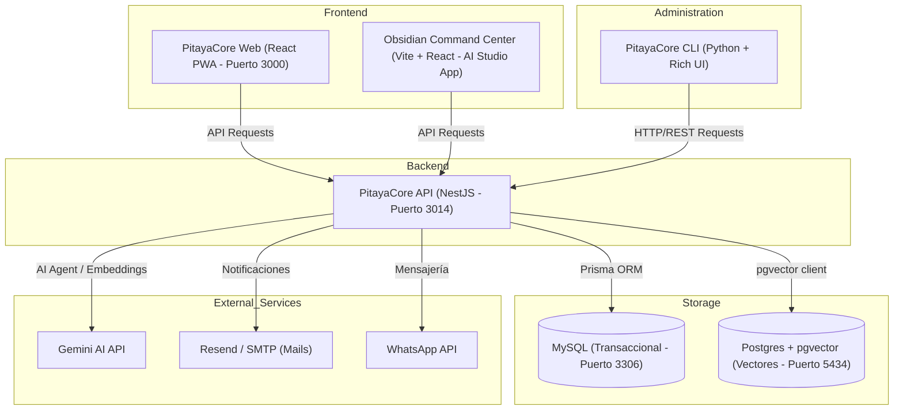

# 🌊 PitayaCore AI — Obsidian Command Center

<div align="center">
  
  
  []()
  []()
  []()
  []()
  []()
</div>

**PitayaCore AI** es una plataforma avanzada y multi-inquilino (multi-tenant) de agentes de Inteligencia Artificial que integra CRM, comercio electrónico, administración de conocimiento (RAG con base de datos vectorial), flujo de aprobación humana (HITL) y campañas automáticas. 

El repositorio contiene tanto la aplicación de administración interactiva (**Obsidian Command Center**) como los submódulos de la API del servidor, el portal web del usuario final y una interfaz de consola (CLI).

---

## 🏛️ Arquitectura del Sistema

El siguiente diagrama detalla cómo se comunican las distintas piezas de PitayaCore:



---

## 📂 Estructura del Repositorio

El proyecto está estructurado de manera modular para separar las distintas responsabilidades:

| Directorio / Archivo | Propósito | Tecnología |
| :--- | :--- | :--- |
| [`/src`](file:///G:/PITAYACODE/PITAYACORE/src) | **Obsidian Command Center** (Root App): Frontend principal cargado e integrado dentro de Google AI Studio. | React + Vite + Tailwind CSS |
| [`/api`](file:///G:/PITAYACODE/PITAYACORE/api) | **PitayaCore API Backend**: Lógica central del sistema, endpoints, agentes, skills, base de datos vectorial e integraciones. | NestJS + Prisma + Socket.io |
| [`/web`](file:///G:/PITAYACODE/PITAYACORE/web) | **PitayaCore Web Frontend**: Panel y landing page para el usuario final. Permite gestionar catálogos, leads y configurar el Studio. | React + Vite + PWA |
| [`/cli`](file:///G:/PITAYACODE/PITAYACORE/cli) | **Terminal de Administración**: Consola interactiva para administración rápida, creación de notas/ideas y consultas directas a la IA. | Python + Rich + Httpx |
| [`/docs`](file:///G:/PITAYACODE/PITAYACORE/docs) | Documentación técnica adicional e información del proyecto. | Markdown |
| [`dev.ps1`](file:///G:/PITAYACODE/PITAYACORE/dev.ps1) | Script automatizado en PowerShell para arrancar todo el entorno de desarrollo local. | PowerShell |
| [`DEPLOYMENT.md`](file:///G:/PITAYACODE/PITAYACORE/DEPLOYMENT.md) | Guía detallada paso a paso para el despliegue a producción. | Markdown |

---

## 🚀 Inicio Rápido (Desarrollo Local)

### Requisitos Previos
Asegúrate de tener instalado en tu sistema:
- **Node.js** (v20 o superior recomendado) y npm.
- **Docker Desktop** (para MySQL y PostgreSQL con soporte pgvector).
- **Python** (v3.12 o superior) si planeas usar el CLI de administración.
- **PowerShell** (habilitado para la ejecución de scripts locales).

---

### 🛠️ Configuración Automática (Recomendado)

Disponemos de un script unificado de PowerShell que verifica tus contenedores de Docker, inicializa los agentes de conocimiento en base de datos y arranca tanto el Backend NestJS como el Frontend de manera concurrente:

1. Ejecuta PowerShell como Administrador en la raíz del proyecto.
2. Lanza el launcher local:
   ```powershell
   .\dev.ps1
   ```

El script se encargará de:
* Levantar los contenedores de MySQL (`pitaya-mysql-prod`) y Postgres Vector (`pitaya-postgres-prod`).
* Inicializar las habilidades y conocimiento base ejecutando `init-skills-fixed.ts`.
* Iniciar el backend de NestJS en una consola externa (`http://localhost:3014`).
* Iniciar el frontend Web React de Vite en otra consola externa (`http://localhost:3000`).

---

### 🔧 Configuración Manual por Componente

Si prefieres levantar los servicios individualmente o no utilizas Windows:

#### 1. Levantar Infraestructura de Datos (Docker)
Asegúrate de iniciar los servicios de base de datos definidos en el archivo de Docker Compose:
```bash
docker compose up -d mysql postgres
```

#### 2. Configurar e Iniciar el Backend (API)
1. Navega al directorio del backend:
   ```bash
   cd api
   ```
2. Instala las dependencias de Node:
   ```bash
   npm install
   ```
3. Configura tus variables de entorno creando un archivo `.env` (puedes tomar como referencia `.env.prod` o usar credenciales locales).
4. Sincroniza e inicializa la base de datos con Prisma y carga las habilidades:
   ```bash
   npx prisma db push
   npx ts-node init-skills-fixed.ts
   ```
5. Arranca el servidor de desarrollo:
   ```bash
   npm run start:dev
   ```

#### 3. Configurar e Iniciar el Frontend (Web)
1. Navega al directorio del frontend:
   ```bash
   cd web
   ```
2. Instala las dependencias:
   ```bash
   npm install
   ```
3. Levanta el servidor local de desarrollo de Vite:
   ```bash
   npm run dev
   ```

---

## 💻 Uso de la Consola de Administración (CLI)

El directorio [`/cli`](file:///c:/PITAYACODE/PITAYACORE/cli) contiene una útil terminal interactiva en Python que se conecta a la API.

### Configuración:
1. Navega al directorio de la CLI:
   ```bash
   cd cli
   ```
2. Instala las dependencias necesarias mediante `uv` o `pip`:
   ```bash
   pip install httpx rich
   ```
3. Ejecuta la aplicación:
   ```bash
   python main.py
   ```

### Características del CLI:
* **Gestión de Notas e Ideas:** Listar, visualizar detalladamente y crear notas/ideas de manera inmediata en el Workspace.
* **Búsqueda Global:** Ejecución de queries de búsqueda en todo tu Workspace.
* **Asistente de IA:** Chat interactivo directo con los agentes inteligentes de PitayaCore.
* **Multi-workspace:** Opción para alternar entre diferentes inquilinos (Tenants) configurados en el backend.

---

## 🧪 Suite de Pruebas (Testing)

El proyecto cuenta con suites de pruebas unitarias e integración configuradas tanto para el API como para la Web:

* **API (NestJS + Jest):** Utiliza Jest para pruebas de servicios y controladores con mockeo de dependencias y base de datos (Prisma).
  ```bash
  cd api
  npm run test        # Ejecuta todas las pruebas del API
  npm run test:cov    # Ejecuta pruebas y muestra cobertura
  ```
* **Web (React + Vitest):** Utiliza Vitest en conjunto con JSDOM y `@testing-library/react` para pruebas de integración de la UI.
  ```bash
  cd web
  npm run test        # Ejecuta las pruebas una vez
  npm run test:watch  # Ejecuta las pruebas en modo observador (watch)
  ```

Para una guía técnica detallada sobre cómo escribir y estructurar pruebas en la plataforma, consulta la **[Guía Técnica de Testing (docs/TESTING.md)](file:///c:/PitayaCode/pitayacore/docs/TESTING.md)**.

---

## 🌎 Despliegue en Producción

El proyecto está diseñado para desplegarse mediante Docker y scripts automatizados en servidores remotos:
* **API (Backend):** Alojada en **Hetzner** bajo contenedores Docker y administrada por scripts SSH.
* **Web (Frontend):** Compilada como estática y subida a **Hostinger** configurando rutas SPA `.htaccess`.

Para instrucciones detalladas sobre el despliegue, variables de producción y sincronización de datos vectoriales, consulta la **[Guía de Despliegue de Producción (DEPLOYMENT.md)](file:///G:/PITAYACODE/PITAYACORE/DEPLOYMENT.md)**.

---
*Mantenido y evolucionado con el soporte de Antigravity (Advanced Agentic Coding)*
