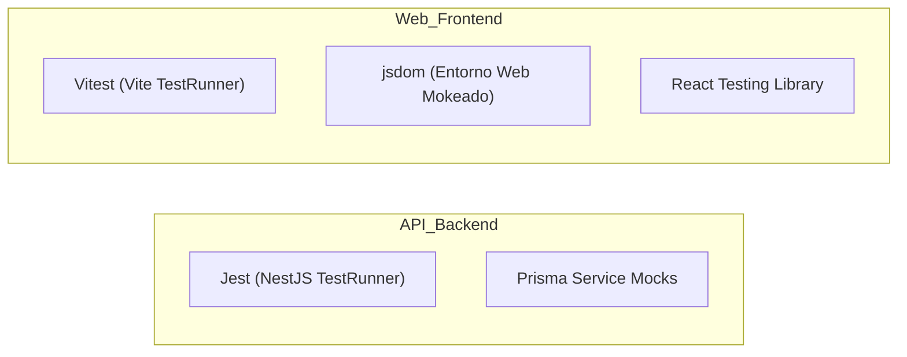

# 🧪 Guía Técnica de Testing - PitayaCore AI

Esta guía documenta la infraestructura, flujo de trabajo y mejores prácticas para escribir y ejecutar pruebas unitarias y de integración en el proyecto **PitayaCore AI**.

---

## 🏛️ Arquitectura de Pruebas

El proyecto cuenta con dos entornos de pruebas totalmente configurados e independientes:



---

## 1. 🖥️ API Backend (NestJS + Jest)

Las pruebas del API utilizan el framework nativo de pruebas de NestJS basado en Jest.

### Comandos de Ejecución
Navega a la carpeta `/api`:
```bash
cd api
npm run test                  # Ejecuta todas las pruebas (*.spec.ts)
npm run test -- <patrón>      # Ejecuta pruebas que coincidan con el patrón (ej. agents)
npm run test:cov              # Reporte de cobertura detallado
```

### Reglas Críticas para Pruebas del API
1. **Mockeo de DatabaseService (Prisma):** 
   Debido a que PitayaCore usa dos clientes Prisma (`@prisma/mysql-client` y `@prisma/postgres-client`), es mandatorio simular la base de datos para no hacer mutaciones reales.
   Ejemplo de mockeo básico en `beforeEach`:
   ```typescript
   const dbMock = {
     mysql: {
       agent: {
         findFirst: jest.fn(),
         create: jest.fn(),
       }
     }
   };
   
   const module = await Test.createTestingModule({
     providers: [
       AgentsService,
       { provide: DatabaseService, useValue: dbMock }
     ]
   }).compile();
   ```
2. **Inyección de Dependencias en NestJS:**
   Incluso si es una prueba unitaria simple, si el constructor del componente inyecta algún servicio, debes proveerlo en el `TestingModule` usando mocks vacíos `useValue: {}` o específicos para evitar errores de inyección en NestJS.

---

## 2. 🌐 Frontend Web (React + Vitest)

Las pruebas del frontend usan **Vitest** en combinación con `@testing-library/react` y `jsdom` para simular el comportamiento del navegador.

### Comandos de Ejecución
Navega a la carpeta `/web`:
```bash
cd web
npm run test        # Ejecuta las pruebas una vez
npm run test:watch  # Ejecuta las pruebas y se queda observando cambios
```

### Reglas Críticas para Pruebas de la Web
1. **Mock del Contexto de Inquilinos (`useTenant`):**
   Todos los componentes que dependen de la sesión o del tenant actual deben tener mockeado el hook `useTenant`. 
   Ejemplo de mockeo global por archivo:
   ```typescript
   vi.mock('../../contexts/TenantContext', () => ({
     useTenant: () => ({
       selectedTenant: { id: 'edd1ac37-5ff9-4e46-bc7f-fff3c414d718', name: 'Acuaequipos' },
       flowApiKey: 'test_api_key',
     }),
   }));
   ```
2. **Mockeo de Axios por URL:**
   Evita usar `mockResolvedValueOnce` consecutivamente si el componente hace múltiples peticiones de forma asíncrona, ya que el orden puede variar. Prefiere usar `mockImplementation` inspeccionando la URL:
   ```typescript
   mockedAxios.get.mockImplementation((url: string) => {
     if (url.includes('/api/agents')) {
       return Promise.resolve({ data: mockAgents });
     }
     return Promise.resolve({ data: [] });
   });
   ```
3. **Mocks de Browser APIs en JSDOM:**
   Si tu componente utiliza funciones de navegador que no están implementadas en JSDOM (como `scrollIntoView`), deben ser añadidas en [setupTests.ts](file:///c:/PitayaCode/pitayacore/web/setupTests.ts):
   ```typescript
   window.Element.prototype.scrollIntoView = function() {};
   ```

---

## 📂 Archivos de Pruebas Relevantes

| Componente | Archivo de Pruebas | Propósito |
| :--- | :--- | :--- |
| **API** | [`agents.service.spec.ts`](file:///c:/PitayaCode/pitayacore/api/src/modules/agents/agents.service.spec.ts) | Prueba lógica de negocios, control de versiones y rollback de agentes. |
| **API** | [`agents.controller.spec.ts`](file:///c:/PitayaCode/pitayacore/api/src/modules/agents/agents.controller.spec.ts) | Valida mapeo de endpoints REST y chat interactivo de agentes. |
| **Web** | [`AgentsManager.test.tsx`](file:///c:/PitayaCode/pitayacore/web/src/modules/agents/AgentsManager.test.tsx) | Pruebas de interfaz para gestión, contratación y edición de perfiles de agentes. |
| **Web** | [`Inbox.test.tsx`](file:///c:/PitayaCode/pitayacore/web/src/modules/inbox/Inbox.test.tsx) | Pruebas de chat de Inbox omnichannel con sockets mockeados. |
